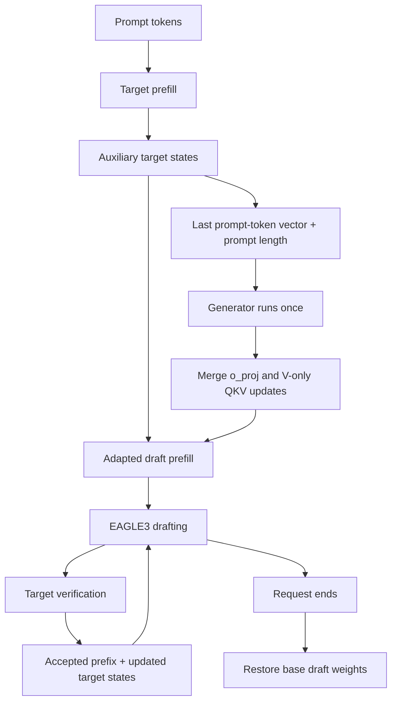

# Conditional LoRA decoding in vLLM 0.31.0

This prototype generates one rank-32 adapter per request after target prefill.
It keeps the existing EAGLE3 decoder and verification path. The generator uses
the last prompt token's raw target states at layers `[2, 18, 33]`, concatenated
in that order, plus prompt length. Deployment context size is **1**, even when
the generator was trained on groups of 1–8 examples.



The generated adapter is fixed throughout decoding. Draft KV is initialized
only after merging, so cached values never mix adapters. The Q and K slices of
the packed QKV projection stay unchanged. Merging computes
`W_base + (alpha / rank) * B @ A` in FP32 and copies the result into BF16 weights.
This introduces BF16 merge rounding relative to applying the two LoRA matrix
products separately. Restoration copies immutable base weights rather than
subtracting updates.

## Export completed adaptation arms

The export command reads the recovery checkpoint once, discards optimizer
state, and writes `model.safetensors`, `bundle.json`, and source provenance.
It never reads the saved hidden-state payloads or prepares prompt summaries.
Export requires `result.json`, `resolved_experiment.json`, `train_command.txt`,
and `speculators.patch` from the completed run, plus its bank manifest. It reads
the pinned drafter's small configuration from the Hugging Face cache.

Run from the repository root, adjusting the source experiment directory:

```bash
EXPERIMENT_ROOT=/content/drive/MyDrive/dynamic-speculators-v3/output/generator-math-stable-v2-lk
INFERENCE_ROOT=/content/drive/MyDrive/dynamic-speculators-v3/output/generator-inference
for arm in fresh_lora transferred_lora fresh_generator pretrained_generator; do
  speculators generator export \
    --config examples/eagle3-lora/generator_math.yaml \
    --run-dir "$EXPERIMENT_ROOT/adaptation/$arm" \
    --output "$INFERENCE_ROOT/$arm"
done
```

Exports require new output directories and retain the source checkpoint SHA256.
Generator exports must use `last` conditioning; the runtime does not silently
reinterpret `last_mean` or `projected` weights. Ordinary LoRA exports retain
their factors without generator conditioning metadata.

## Apply the pinned Python-source patch

Use the existing vLLM **0.31.0** installation and this repository installed with
the `generator` extra. The patch targets release commit
`db9527a46873454610df6dbedf79a36d6bf1a7f6`. It adds the optional
`speculative_config.draft_adapter_path` field and proposer/request-lifecycle
hooks; no new model architecture or native kernel build is needed.

```bash
python scripts/apply_vllm_generator_patch.py --check
python scripts/apply_vllm_generator_patch.py --apply
python scripts/apply_vllm_generator_patch.py --check
```

The utility checks the complete original source-file hashes before any writes,
backs up the three modified files, and recognizes an already applied patch.
Unknown sources or a partially modified installation are rejected. A custom
build reporting `0.31.0` but containing different sources is not supported.
`--vllm-root` can explicitly select the directory containing `vllm/`.

Revert after stopping processes using the patched installation:

```bash
python scripts/apply_vllm_generator_patch.py --revert
```

Benchmark subprocesses import the updated files afresh. Existing Python/vLLM
processes must be restarted to use the patch. Stop training and serving
processes before the GPU benchmark so they do not occupy its VRAM.

## Run the serial benchmark

Check the bundle paths and W&B settings in
`examples/eagle3-lora/vllm_math.yaml`, then run:

```bash
speculators generator benchmark --config examples/eagle3-lora/vllm_math.yaml --smoke
speculators generator benchmark --config examples/eagle3-lora/vllm_math.yaml
```

The smoke run uses three prompts, one warmup, one measured pass, and at most 32
output tokens, saving under `output_root/smoke`. The full defaults use the 100
math-00001 validation prompts, three warmups, and three measured passes. Output
length inherits the bank response cap and is clipped to remaining context.
All arms use exactly the saved prompt token IDs before `prompt_length`; no chat
template is applied again. Responses use greedy decoding and the same seed.

Six arms run in isolated processes: target only, base EAGLE3, adapted fresh
ordinary LoRA, adapted transferred ordinary LoRA, adapted fresh generator, and
adapted bank-pretrained generator. Restrict `arms` to a smaller comparison if
needed; `target_only` must remain first, and every chosen adapter arm needs a
matching exported bundle. Complete matching arms are reused after interruption.
Changed measurement settings require a new output directory.

The prototype requires one active sequence, TP/PP/DP=1, BF16, eager target and
draft execution, synchronous scheduling, unchunked prefill, and prefix caching
disabled. It accepts only an unquantized single-layer drafter with matching
projection shapes, normalization flags, and pinned model revisions. Larger
context groups, concurrent serving, CUDA graphs, and quantized merging remain
future work.

The patch hooks the **V1 model runner**, not vLLM 0.31.0's default V2 runner.
Every benchmark subprocess sets `VLLM_USE_V2_MODEL_RUNNER=0` before importing
vLLM, including target-only and base EAGLE3 arms. This makes the runner consistent
across the comparison. For a custom launcher, set this environment variable
before starting Python. Each arm saves `runtime.json` with the actual runner,
proposer class, and controller presence. Startup rejects V2 or a missing adapter
controller before sending any warmup or measured requests.

The generator stays resident on the GPU. Its generation and merge workspace are
exercised during memory profiling before KV-cache sizing. A worker RPC restores
the adapter after each request and returns timings; cancellation cleanup also
runs through the request lifecycle hook. Profiling does not create request
state or count as a generator invocation.

vLLM 0.31.0 adds an eight-character random suffix to internal request IDs.
The request-end RPC resolves the external response ID against the current or
last completed internal adapter record, retaining both IDs in per-request stats.
An unknown ID never restores another request's adapter. Missing records or an
incorrect generator invocation count stop the run and save `adapter_failure.json`
with the worker's controller state and request IDs for diagnosis.

## Metrics and interpretation

`result.json` for each arm contains per-request output IDs, repetitions, prompt
membership, elapsed time, generator/merge/restoration times, invocation count,
and peak allocated GPU memory. Total request latency includes the request-end
RPC and restoration. That RPC runs for every arm for a matched comparison.
Engine construction/model loading and warmups are excluded; generator execution
on measured requests is included. Acceptance counters are differenced per
request to exclude warmup traffic.

- Acceptance ratio: accepted draft tokens / proposed draft tokens.
- Accepted length: `1 + accepted draft tokens / drafting rounds`.
- Per-position acceptance: accepted count at that position / drafting rounds.
- Output throughput: total output tokens / total measured request time.

Target-only acceptance is undefined and exported as null, rather than presented
as a perfect acceptance score. The benchmark checks greedy output token IDs
against target-only decoding. `output_mismatch: error` (the configuration default)
stops if an arm differs. The example YAML explicitly sets `output_mismatch: warn`
to continue exploratory measurements. Both policies save `output_disagreement.json`
with every differing request, first differing position, token IDs, surrounding
token IDs, and output lengths. No numerical cause is inferred from a mismatch.
Request count or prompt membership/order differences always stop the benchmark.

Each arm's result, comparison CSV, and W&B summary include `output_equivalence`
(`reference`, `matched`, or `unverified`), `mismatched_requests`, and
`exact_match_fraction`. Comparison figures flag unverified outputs. A matching
token sequence establishes equality for these measured requests; a permissive
result does not establish lossless decoding. Investigate mismatches before
claiming equivalent-output speedups. Checks also run on reused completed arms.

The permissive example uses `generator-vllm-math-v1-runner` as its output
directory to preserve earlier strict runs. After updating benchmark code or
measurement settings, use a fresh output directory as required by the resume
identity check; do not delete prior results to bypass that check.

The root contains `comparison.csv`, `comparison.png`, `comparison.pdf`, and
`results.json`. W&B uses the separate `eagle3-generator-vllm` project. Run names
identify the arm and deployment context size; direct LoRA names omit generator
conditioning labels. Set `wandb.enabled: false` to disable tracking, or use
`wandb.mode: offline` to retain local W&B bundles.

Results must retain the resolved benchmark configuration, selected prompts,
engine arguments, evaluation/vLLM command records, vLLM source patch, target and
drafter checksums, exported bundle metadata, and source training provenance.
The original training and extraction artifacts remain part of the source run's
reproducibility record. This uses validation data already used during generator
selection, so acceptance/speed results are exploratory. CPU tests establish
export and controller behavior; real-model correctness and speed require the
GPU smoke run.
